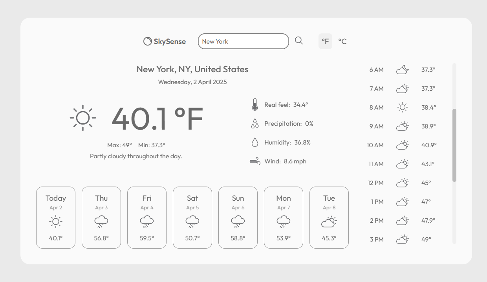

# SkySense

SkySense is a minimalistic, responsive weather app build with JavaScript, Webpack and the VisualCrossing API. Enter a place in the search box to obtain essential information about the current weather, the forecast for the next hours and upcoming days.



## Features

- Two unit groups available: Metric and US units.
- Click on any of the upcoming days of the week to obtain get detailed weather information.
- Detailed weather information includes: wind speed, probability of precipitation, humidity, hourly weather, and more.
- Responsive design.

## Try it now!

Click here to get your weather forecast:

## Installation

To set up the project locally, follow these steps:

1. Clone the repository:

   ```sh
   git clone https://github.com/dot-sky/todo-app.git
   cd todo-app
   ```

2. Install dependencies:

   ```sh
   npm install
   ```

3. Start the development server:

   ```sh
   npm run dev
   ```

   This will launch the app in a local development environment with live-reloading enabled.

## Credits

- Weather icons by <a href="https://uifresh.net/product/weather-icons/" title="weather icons">uifresh</a>
- Uicons by <a href="https://www.flaticon.com/uicons">Flaticon</a>
- Logo icon by <a href="https://www.flaticon.com/authors/icon-wind" title="logo icon">wind - Flaticon</a>
